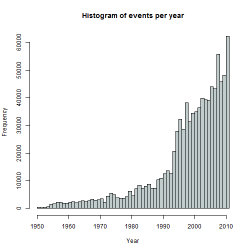
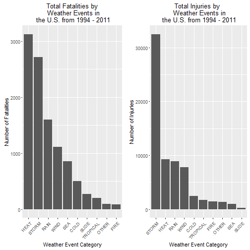
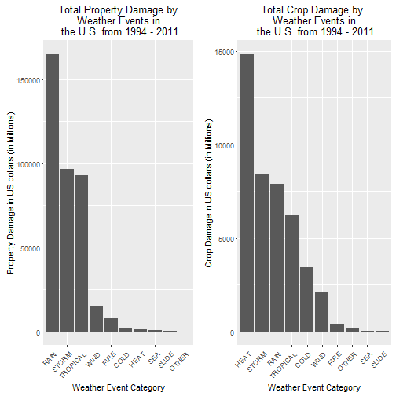

# Analysis of severe weather events in United States through NOAA Storm Database exploration.

By Gregorio Ambrosio Cestero
December 24, 2015

This report explores the U.S. National Oceanic and Atmospheric Administration's (NOAA) storm database to investigate the types of severe weather events that have the largest impact to public health, and those types that result on property and crop damage. This study focus on the 1994-2011 period in which more complete records are kept for severe weather events. Also, this study is based on aggregation of weather events in categories to allow a more consistently view of data. From this study it can be concluded that heat and storm related weather events are the most dangerous to people, while rain and heat are the most costly event type categories to the economy.

## Data Processing

### Loading data
First of all, we try to download the file if it isn't in the workspace. Then store it in the StormData variable.


```r
filename <- "repdata-data-StormData.csv.bz2"
if (!file.exists(filename)) {
        fileurl <- "http://d396qusza40orc.cloudfront.net/repdata%2Fdata%2FStormData.csv.bz2"
        download.file(fileurl, filename, "auto")
}
StormData <- read.csv(filename)
```
There are 902297 rows and 37 cols in the database.The events in the database start in the year 1950 and end in November 2011. In the earlier years of the database there are generally fewer events recorded, most likely due to a lack of good records. More recent years should be considered more complete.

### Data exploration: reducing data set

In order to get a more tractable dataset respect to processing time we just keep the columns needed for the analysis


```r
StormData <- StormData[, c("BGN_DATE", "EVTYPE", "FATALITIES", "INJURIES", "PROPDMG", "PROPDMGEXP", "CROPDMG", "CROPDMGEXP")]
```

The events in the database are recorded from 1950 to 2011 but in the next histogram we can observe data in the first years in which there are fewer events recorded, however recent years are more complete with more records.


```r
StormData$YEAR <- as.numeric(format(as.Date(StormData$BGN_DATE, format = "%m/%d/%Y"), "%Y"))
hist(StormData$YEAR, breaks = 50, main = "Histogram of events per year", xlab="Year", col="azure3")
```

 

Based on the graph, we select the subset from 1994 to 2011. Due to year 1994 which is the first year with an generous increase in events, so we can expect a more consistent balance among event types.


```r
StormData <- StormData[StormData$YEAR >= 1994, ]
```

Now we have 702131 rows and 9 cols in the database

### Processing data to get the most harmful events with respect to population health

If we observe the event types, there are a lot of not consistent names, possibly for similar, if not equal, same event type. For example, we can observe "EXCESSIVE HEAT", "HEAT", "RECORD HEAT" and so on, perhaps for the same event type.

We are looking for the most harmful events so we aggregate the number of fatalities and injuries per event type.


```r
library(plyr)

fatalities <- ddply(StormData, "EVTYPE", summarize, QTY = sum(FATALITIES, na.rm = T))
fatalities <- arrange(fatalities,fatalities[,2],decreasing = T)
head (fatalities, n = 20)
```

```
##                     EVTYPE  QTY
## 1           EXCESSIVE HEAT 1903
## 2                  TORNADO 1593
## 3              FLASH FLOOD  951
## 4                     HEAT  930
## 5                LIGHTNING  794
## 6                    FLOOD  450
## 7              RIP CURRENT  368
## 8                HIGH WIND  242
## 9                TSTM WIND  241
## 10               AVALANCHE  224
## 11            RIP CURRENTS  204
## 12            WINTER STORM  195
## 13               HEAT WAVE  172
## 14            EXTREME COLD  150
## 15       THUNDERSTORM WIND  133
## 16 EXTREME COLD/WIND CHILL  125
## 17              HEAVY SNOW  123
## 18             STRONG WIND  103
## 19               HIGH SURF  101
## 20              HEAVY RAIN   98
```

```r
injuries <- ddply(StormData, "EVTYPE", summarize, QTY = sum(INJURIES, na.rm = T))
injuries <- arrange(injuries,injuries[,2],decreasing = T)
head (injuries, n = 20)
```

```
##                EVTYPE   QTY
## 1             TORNADO 22571
## 2               FLOOD  6778
## 3      EXCESSIVE HEAT  6525
## 4           LIGHTNING  5116
## 5           TSTM WIND  3631
## 6                HEAT  2095
## 7           ICE STORM  1971
## 8         FLASH FLOOD  1754
## 9   THUNDERSTORM WIND  1476
## 10       WINTER STORM  1298
## 11  HURRICANE/TYPHOON  1275
## 12          HIGH WIND  1099
## 13         HEAVY SNOW   980
## 14               HAIL   943
## 15           WILDFIRE   911
## 16                FOG   734
## 17 THUNDERSTORM WINDS   727
## 18   WILD/FOREST FIRE   545
## 19         DUST STORM   439
## 20     WINTER WEATHER   398
```

But to deal with the inconsistencies in event names we prefer to summarize them in ten categories 


```r
StormData[grepl("HEAT|WARM|DRY|HOT|DROUGHT|HYPERTHERMIA",StormData$EVTYPE, ignore.case = TRUE), "EVCATEGORY"] <- "HEAT"
StormData[grepl("COLD|COOL|HYPOTHERMIA|WINT|ICE|SNOW|BLIZZARD|FREEZ|ICY|FROST",StormData$EVTYPE, ignore.case = TRUE), "EVCATEGORY"] <- "COLD"                
StormData[grepl("FLOOD|FLD|RAIN|PRECIP",StormData$EVTYPE, ignore.case = TRUE), "EVCATEGORY"] <- "RAIN"
StormData[grepl("COASTAL|TSUNAMI|CURRENT|MARINE|WATER|SURF|SLEET|SEAS|WAVES|SWELLS|BEACH",StormData$EVTYPE, ignore.case = TRUE), "EVCATEGORY"] <- "SEA"
StormData[grepl("STORM|TSTM|HAIL|LIGH|TORNADO",StormData$EVTYPE, ignore.case = TRUE), "EVCATEGORY"] <- "STORM"
StormData[grepl("TROPICAL|TYPHOON|HURRICANE",StormData$EVTYPE, ignore.case = TRUE), "EVCATEGORY"] <- "TROPICAL"
StormData[grepl("WIND|BURST",StormData$EVTYPE, ignore.case = TRUE), "EVCATEGORY"] <- "WIND"
StormData[grepl("FIRE",StormData$EVTYPE, ignore.case = TRUE), "EVCATEGORY"] <- "FIRE"
StormData[grepl("SLIDE|AVALANCHE",StormData$EVTYPE, ignore.case = TRUE), "EVCATEGORY"] <- "SLIDE"
StormData[is.na(StormData$EVCATEGORY),"EVCATEGORY"] <- "OTHER"
```

Now we have a more consistent view by event categories


```r
fatalities <- ddply(StormData, "EVCATEGORY", summarize, QTY = sum(FATALITIES, na.rm = T))
print(fatalities)
```

```
##    EVCATEGORY  QTY
## 1        COLD  506
## 2        FIRE   87
## 3        HEAT 3127
## 4       OTHER   92
## 5        RAIN 1605
## 6         SEA  853
## 7       SLIDE  268
## 8       STORM 2720
## 9    TROPICAL  199
## 10       WIND 1110
```

```r
injuries <- ddply(StormData, "EVCATEGORY", summarize, QTY = sum(INJURIES, na.rm = T))
print(injuries)
```

```
##    EVCATEGORY   QTY
## 1        COLD  2487
## 2        FIRE  1458
## 3        HEAT  9225
## 4       OTHER  1332
## 5        RAIN  8933
## 6         SEA   976
## 7       SLIDE   226
## 8       STORM 32474
## 9    TROPICAL  1715
## 10       WIND  7790
```

### Processing date to study the economic consequences

We need to convert the property damage and crop damage data into comparable numerical forms according to the meaning of units described in the code book. PROPDMGEXP and CROPDMGEXP columns mean a multiplier for each observation where Hundred (H), Thousand (K), Million (M) and Billion (B).


```r
StormData$PROPDMGEXP <- as.character(StormData$PROPDMGEXP)
StormData$PROPDMGEXP[toupper(StormData$PROPDMGEXP) == "B"] <- "9"
StormData$PROPDMGEXP[toupper(StormData$PROPDMGEXP) == "M"] <- "6"
StormData$PROPDMGEXP[toupper(StormData$PROPDMGEXP) == "K"] <- "3"
StormData$PROPDMGEXP[toupper(StormData$PROPDMGEXP) == "H"] <- "2"
StormData$PROPDMGEXP[toupper(StormData$PROPDMGEXP) == ""] <- "0"
StormData$PROPDMGEXP = as.numeric(StormData$PROPDMGEXP)
StormData$PROPDMGEXP[is.na(StormData$PROPDMGEXP)] <- 0
StormData$PROPDMGUNITS <- StormData$PROPDMG * 10^StormData$PROPDMGEXP


StormData$CROPDMGEXP <- as.character(StormData$CROPDMGEXP)
StormData$CROPDMGEXP[toupper(StormData$CROPDMGEXP) == "B"] <- "9"
StormData$CROPDMGEXP[toupper(StormData$CROPDMGEXP) == "M"] <- "6"
StormData$CROPDMGEXP[toupper(StormData$CROPDMGEXP) == "K"] <- "3"
StormData$CROPDMGEXP[toupper(StormData$CROPDMGEXP) == "H"] <- "2"
StormData$CROPDMGEXP[toupper(StormData$CROPDMGEXP) == ""] <- "0"
StormData$CROPDMGEXP = as.numeric(StormData$CROPDMGEXP)
StormData$CROPDMGEXP[is.na(StormData$CROPDMGEXP)] <- 0
StormData$CROPDMGUNITS <- StormData$CROPDMG * 10^StormData$CROPDMGEXP
```


```r
propdmg <- ddply(StormData, "EVCATEGORY", summarize, QTY = sum(PROPDMGUNITS, na.rm = T))
print(propdmg)
```

```
##    EVCATEGORY          QTY
## 1        COLD   1494144250
## 2        FIRE   7882628500
## 3        HEAT   1066431750
## 4       OTHER     38489480
## 5        RAIN 164954304065
## 6         SEA    690484260
## 7       SLIDE    335398900
## 8       STORM  96540551999
## 9    TROPICAL  92916532560
## 10       WIND  15324728813
```

```r
cropdmg <- ddply(StormData, "EVCATEGORY", summarize, QTY = sum(CROPDMGUNITS, na.rm = T))
print(cropdmg)
```

```
##    EVCATEGORY         QTY
## 1        COLD  3416257900
## 2        FIRE   403281630
## 3        HEAT 14826535280
## 4       OTHER   143035950
## 5        RAIN  7885571400
## 6         SEA    41728500
## 7       SLIDE    20017000
## 8       STORM  8433664433
## 9    TROPICAL  6200008800
## 10       WIND  2130487638
```


## Results
Now, after processing data, we are in the best position to present results to answer the following questions respect to the U.S.:

1. Which types of events are most harmful with respect to population health?
2. which types of events have the greatest economic consequences?

###Largest Impact to Public Health
We begin, reordering fatalities and injuries and plot them to get the most harmhul events by category


```r
library(ggplot2)
library(grid)
library(gridExtra)

fatalities <- arrange(fatalities,fatalities[,2],decreasing = F)
fatalities$EVCATEGORY <- factor(fatalities$EVCATEGORY, levels=rev(fatalities$EVCATEGORY))

injuries <- arrange(injuries,injuries[,2],decreasing = F)
injuries$EVCATEGORY <- factor(injuries$EVCATEGORY, levels=rev(injuries$EVCATEGORY))


g.fatalities <- qplot(EVCATEGORY, data = fatalities, weight = QTY, geom = "bar") + 
        theme(axis.text.x = element_text(angle = 45, hjust = 1)) + 
        xlab("Weather Event Category") +
        scale_y_continuous("Number of Fatalities")+ 
        ggtitle("Total Fatalities by\n Weather Events in\n the U.S. from 1994 - 2011")

g.injuries <- qplot(EVCATEGORY, data = injuries, weight = QTY, geom = "bar") + 
        theme(axis.text.x = element_text(angle = 45, hjust = 1)) + 
        xlab("Weather Event Category") +
        scale_y_continuous("Number of Injuries") + 
        ggtitle("Total Injuries by \n Weather Events in\n the U.S. from 1994 - 2011")

grid.arrange(g.fatalities, g.injuries, ncol = 2)
```

 

We can observe that the aggregation of heat related weather events are the deadliest, followed by storm and rain related events. However, regarding injuries, we can see that related storms events have the largest effects on population health with a big distance to a second group of categories such as heat, rain and wind.

###Largest economic impact on properties and crops
As previously, we reorder the property and crop damages to plot them in an useful way that enable us to answer about the type of events that have the largest economic consequences.


```r
propdmg <- arrange(propdmg,propdmg[,2],decreasing = F)
propdmg$EVCATEGORY <- factor(propdmg$EVCATEGORY, levels=rev(propdmg$EVCATEGORY))

cropdmg <- arrange(cropdmg,cropdmg[,2],decreasing = F)
cropdmg$EVCATEGORY <- factor(cropdmg$EVCATEGORY, levels=rev(cropdmg$EVCATEGORY))

g.propdmg <- qplot(EVCATEGORY, data = propdmg, weight = QTY/1000000, geom = "bar") + 
        theme(axis.text.x = element_text(angle = 45, hjust = 1)) + 
        xlab("Weather Event Category") +
        scale_y_continuous("Property Damage in US dollars (in Millions)") + 
        ggtitle("Total Property Damage by\nWeather Events in\n the U.S. from 1994 - 2011")

g.cropdmg <- qplot(EVCATEGORY, data = cropdmg, weight = QTY/1000000, geom = "bar") + 
        theme(axis.text.x = element_text(angle = 45, hjust = 1)) + 
        xlab("Weather Event Category") + 
        scale_y_continuous("Crop Damage in US dollars (in Millions)") + 
        ggtitle("Total Crop Damage by \nWeather Events in\n the U.S. from 1994 - 2011")

grid.arrange(g.propdmg, g.cropdmg, ncol = 2)
```

 

Regarding to property damage we can see that related rain events are the most damaging in an economic sense followed by a second group of  categories such as storm and tropical events. On the other hand, regarding to crop damage, the most damaging event category is heat followed distantly by the storm, rain and tropical categories. 
 


